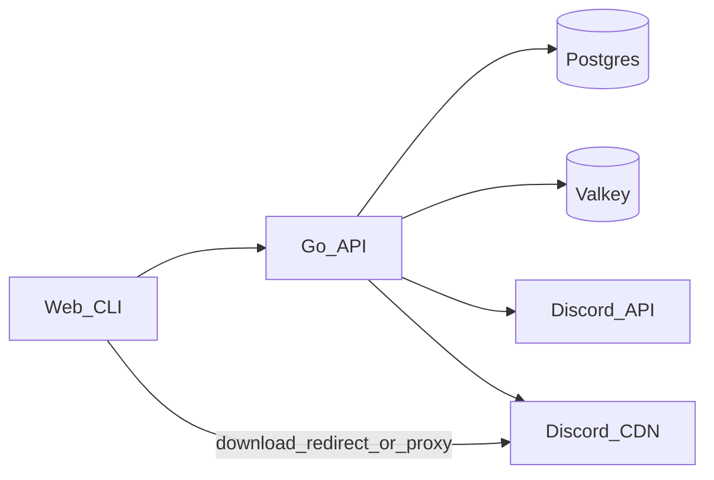

# DisCloud

[](https://github.com/mewisme/discloud-go/actions/workflows/ci.yml) [](https://github.com/mewisme/discloud-go/actions/workflows/release.yml) [](go.mod) [](https://github.com/mewisme/discloud-go/releases/latest) [](https://github.com/mewisme/discloud-go/pkgs/container/discloud) [](LICENSE)

Self-hosted file host that stores files as **8 MiB Discord attachments**, with a **Postgres** index, **Valkey** CDN URL cache, **Go API**, **Next.js** UI, and **`discloud` CLI**.

- Content-addressed chunks and resumable upload sessions
- Public/private files; cookie sessions; first user on a fresh DB is `admin`
- Compose stack: API + web + Postgres 18 + Valkey 8
- CLI via `/install.sh`, `/install.ps1`, Scoop, or Homebrew

## Why

You want shareable file hosting without buying object storage. DisCloud keeps metadata, auth, retention, and download URLs in your stack, and puts the bytes in Discord message attachments.

Delete and cancel remove **Postgres rows only** — Discord attachments are never purged by the app. Incomplete uploads are not `files` rows until complete.

## Features

### Storage

- 8 MiB chunks (Discord bot attachment limit without Nitro boosts)
- SHA-256 content-addressed chunk store; skip known hashes on re-upload
- Multiple bot tokens (comma-separated) round-robin uploads
- Max 8192 chunks per file (~64 GiB)
- Valkey caches Discord CDN URLs

### Uploads

- Upload sessions: create → put chunks → register parts → complete / cancel
- Legacy `POST /api/upload` and `POST /api/upload/complete` still work
- Web: multi-file and folder upload (relative paths preserved); IndexedDB resume after reload (re-select the same file); per-file retry
- CLI: checkpoints under the config dir `uploads/`; resume on same path + size + mtime; folder walk; `--abort` cancels the session

### Files & auth

- List / get / inspect; public or private; rotate access token; metadata-only delete
- Share controls: password (Argon2id), custom expiry (cap +30d), download cap, `view`|`download` mode, revoke
- Browser unlock: `POST /api/files/{id}/unlock` → cookie; CLI/API: `X-File-Password`
- Retention: anonymous **7d**, signed-in **30d**; full `?download=1` extends **+7d** (cap 30d)
- File `status`: `ready` (new) or `reused` (same owner re-completed identical parts)
- Session cookie `discloud_session`; signup / signin / signout / password / preferences
- Auth rate limit: 10 attempts / 15 minutes (Valkey)

### Clients & ops

- Next.js UI (`/`, `/files`, `/docs`, sign-in/up, file page)
- CLI: `auth`, `upload`, `files`, `get`, `chunks`, `config`, `health`, `ready`
- `/healthz`, `/readyz` (Postgres + Valkey), GHCR images, GoReleaser on `v*` tags

## Architecture



| Piece | Role |
| --- | --- |
| `cmd/discloud` | HTTP API server |
| `cmd/discloud-cli` | Client binary (`discloud`) |
| `web/` | Next.js UI |
| `internal/server` | Routes, upload/download, auth gates |
| `internal/store` | Postgres metadata + migrations |
| `internal/discord` | Discord API v10 attachment uploads |
| `internal/cache` | Valkey CDN URL cache |
| `internal/client` | Shared HTTP client for the CLI |

## Quick start

1. Create a Discord bot with **Attach Files** permission and note a channel ID.
2. Configure env:

```bash
cp .env.example .env
# set DISCORD_BOT_TOKEN, DISCORD_CHANNEL_ID, WEB_ORIGIN
```

3. Start the stack:

```bash
docker compose up -d
```

| | |
| --- | --- |
| UI | http://localhost:3000 |
| API | http://localhost:8080 |
| Docs | http://localhost:3000/docs |

Images: `ghcr.io/mewisme/discloud` and `ghcr.io/mewisme/discloud-web` (`DISCLOUD_TAG`, default `latest`).

Build from source instead of pulling:

```bash
docker compose -f docker-compose.yml -f docker-compose.build.yml up --build -d
```

## Installation

### Docker Compose (recommended)

Pull-and-run (default `docker-compose.yml`) or build locally with `docker-compose.build.yml` as above.

### CLI

From a running DisCloud instance:

```bash
curl -fsSL https://your.app/install.sh | sh          # macOS / Linux
irm https://your.app/install.ps1 | iex               # Windows
```

Or package managers / from source:

```bash
scoop install mew/discloud-cli
brew install --cask discloud-cli
go build -o discloud-cli ./cmd/discloud-cli
```

The released client command is `discloud` (Scoop/Homebrew shim). The API container entrypoint is `/discloud`.

### API from source

Requires **Go 1.26.3+** (see `go.mod`), Postgres, Valkey, and Discord credentials:

```bash
go run ./cmd/discloud
```

## Configuration

Full reference: [`.env.example`](.env.example).

### API — required

| Variable | Description |
| --- | --- |
| `DISCORD_BOT_TOKEN` | One token, or comma-separated tokens for round-robin uploads |
| `DISCORD_CHANNEL_ID` | Channel where attachments are posted |
| `WEB_ORIGIN` | Exact browser origin for CORS + cookies (no path/query), e.g. `http://localhost:3000` |
| `DATABASE_URL` | Postgres connection string |
| `VALKEY_URL` | Valkey connection string |

Compose injects `DATABASE_URL` and `VALKEY_URL` for containers. Set them yourself for `go run` / `make run`.

### API — optional

| Variable | Default | Description |
| --- | --- | --- |
| `PORT` | `8080` | Listen port |
| `API_URL` | (derive from request) | Public API origin for share links; not the UI URL |
| `APP_SECRET` | auto `.app.secret` | HMAC root (≥32 chars). Env wins over file. Docker: `/data/.app.secret` |
| `TRUST_PROXY` | off | Honor `X-Forwarded-For` / `X-Real-IP` only behind an edge that strips client values |

`WEB_ORIGIN` using `https` sets the session cookie Secure flag.

### Compose / web

| Variable | Default | Description |
| --- | --- | --- |
| `DISCLOUD_TAG` | `latest` | GHCR image tag |
| `POSTGRES_PASSWORD` | `discloud` | Postgres password |
| `API_URL` | `http://localhost:8080` | Browser-facing API origin (web + API share links) |
| `API_UPSTREAM` | `http://api:8080` (compose) | Server-side proxy for `/install.sh` and `/install.ps1` |

### CLI

| Variable | Description |
| --- | --- |
| `DISCLOUD_BASE` | API origin |
| `DISCLOUD_ORIGIN` | Must match server `WEB_ORIGIN` (CSRF) |

Resolution: env → `config.json` → `http://localhost:8080` / `http://localhost:3000`. Flags `--base` / `--origin` override after load. See `discloud config --help`.

### Fixed product limits (not env)

| Limit | Value |
| --- | --- |
| Chunk size | 8 MiB |
| Max chunks / file | 8192 (~64 GiB) |
| Anon / authed file retention | 7d / 30d |
| Download extend | +7d (cap 30d from now) |
| Upload session TTL | anon 24h / auth 48h |
| Max open upload sessions | 20 |
| Auth rate limit | 10 / 15m |

## Usage

### Web

Open http://localhost:3000 — upload files or folders, manage visibility, copy share links. In-app HTTP notes: `/docs`.

### CLI

```bash
discloud config set --base https://api.example.com --origin https://app.example.com
discloud auth login
discloud upload ./file.bin
discloud upload ./my-folder
discloud upload --abort ./file.bin
discloud files list
discloud files share <id> --password 'secret-pass' --mode view --max-downloads 10
discloud files revoke <id> -y
discloud get <file-id> --password 'secret-pass' --download --out ./downloaded.bin
```

### Upload sessions (HTTP)

Preferred path (also used by web + CLI):

1. `POST /api/uploads` → `uploadId` + `resumeToken`
2. `GET /api/chunks/{hash}` / `POST /api/chunks` (skip known hashes)
3. `PUT /api/uploads/{id}/parts/{idx}` with `{hash}` (or batch `POST …/parts`)
4. `POST /api/uploads/{id}/complete` (idempotent)
5. `DELETE /api/uploads/{id}` to cancel (does **not** purge Discord blobs)

`GET /api/info` reports `chunkSize` and `uploads.sessions: true`.

## API

| | |
| --- | --- |
| Base | `http://localhost:8080` (or your `API_URL`) |
| Auth | Session cookie `discloud_session`; browser calls need matching `Origin` (`WEB_ORIGIN`) |
| Private files | Owner session, or one-time `accessToken` (`?token=` / `X-File-Token`) |
| Password shares | After visibility/token: unlock cookie or `X-File-Password`; missing/wrong → 401 |
| Upload resume | `X-Upload-Token` or `?token=` on session routes |

```bash
curl -s http://localhost:8080/api/info
# {"chunkSize":8388608,"uploads":{"sessions":true,"maxFileSize":68719476736}}
```

Downloads: `GET /f/{id}` (optional name suffix). Single-chunk files often **302** to Discord CDN; multi-chunk or ranged requests stream through the API.

Fuller route notes: http://localhost:3000/docs

## Development

```text
cmd/discloud       API server
cmd/discloud-cli   CLI client
internal/         server, store, discord, cache, auth, client, config
web/              Next.js UI
```

```bash
cp .env.example .env   # Discord + WEB_ORIGIN; for local API also DATABASE_URL + VALKEY_URL

make up                # compose stack
# or:
make run               # go run ./cmd/discloud
make web-dev           # cd web && pnpm run dev  (set API_URL in web/.env.local)

make test              # go vet + go test
make lint              # gofmt check + web lint/tsc
make build             # dist/discloud + dist/discloud-cli
```

CI (push/PR): gofmt, `go vet`, `go test`, web lint/typecheck/build, Docker image builds (no push).  
Release: tag `v*` → GoReleaser (CLI + GHCR `discloud` / `discloud-web`).

## Docker

| Service | Image | Ports |
| --- | --- | --- |
| api | `ghcr.io/mewisme/discloud` | 8080 |
| web | `ghcr.io/mewisme/discloud-web` | 3000 |
| postgres | `postgres:18-alpine` | internal |
| valkey | `valkey/valkey:8-alpine` | internal |

- Volumes: `discloud-pgdata` (Postgres), `discloud-data` (API cwd `/data` — `.app.secret`, `.visitor.secret`)
- Network: `discloud` (bridge)
- Compose sets memory limits; Valkey is cache-only (no AOF/RDB)

**Production:** path-proxy `/api/*`, `/f/*`, `/install.*`, `/readyz` to the API. Set `API_URL` to that public origin. Set `TRUST_PROXY=true` only behind an edge that strips client-supplied forwarding headers. Recreate api+web after changing `API_URL`.

## Security

- Auth is cookie sessions + CSRF tied to `WEB_ORIGIN`. There are no personal access tokens.
- Private files need ownership or a one-time access token (rotatable).
- Password-protected shares use Argon2id; denials are 401 (`password_required` / `password_invalid`).
- Keep `DISCORD_BOT_TOKEN`, DB credentials, and `APP_SECRET` out of git and logs. Persist `/data` so secrets survive restarts.
- Delete/cancel/revoke do not remove Discord attachments. Attachment lifetime is controlled by Discord, not this app.
- Auth endpoints are rate-limited; upload/download quotas are not.

Report vulnerabilities privately — see [SECURITY.md](SECURITY.md).

## FAQ

**Does delete remove files from Discord?**  
No. Only Postgres metadata (and related index rows) are removed.

**Can I resume after a browser reload?**  
Yes: IndexedDB keeps the session; re-select the same file. CLI resumes when path, size, and mtime match.

**Why is the container binary `/discloud` but the CLI is `discloud`?**  
The API image runs the server as `/discloud`. The client package installs as `discloud`.

## Contributing

See [CONTRIBUTING.md](CONTRIBUTING.md). Before a PR:

```bash
gofmt -w .
go vet ./...
go test ./...
cd web && pnpm run lint && pnpm exec tsc --noEmit && pnpm run build
```

## License

[MIT](LICENSE) · [Code of Conduct](CODE_OF_CONDUCT.md) · [Security](SECURITY.md)
